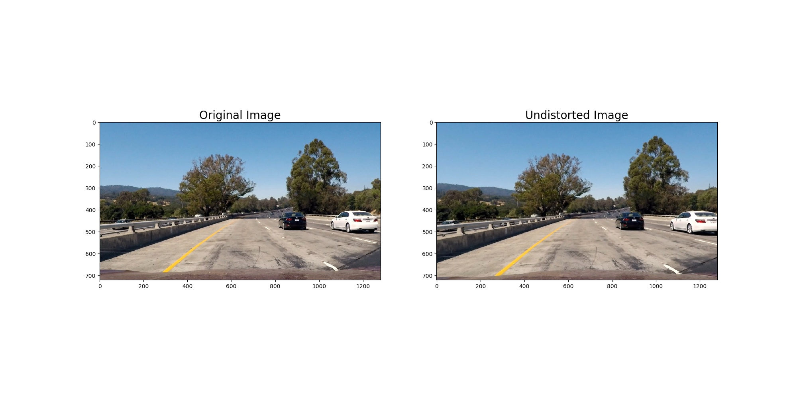

### Writeup / README


### Camera Calibration

#### 1. Briefly state how you computed the camera matrix and distortion coefficients. Provide an example of a distortion corrected calibration image.

Camera calibration code can be found at "`camera_calibration.py`.

I followed the course's example code by preparing "object points", which will be the (x, y, z) coordinates of the chessboard corners in the world. Here I am assuming the chessboard is fixed on the (x, y) plane at z=0, such that the object points are the same for each calibration image.  Thus, `objp` is just a replicated array of coordinates, and `objpoints` will be appended with a copy of it every time I successfully detect all chessboard corners in a test image.  `imgpoints` will be appended with the (x, y) pixel position of each of the corners in the image plane with each successful chessboard detection.  

I then used the output `objpoints` and `imgpoints` to compute the camera calibration and distortion coefficients using the `cv2.calibrateCamera()` function.  I applied this distortion correction to the test image using the `cv2.undistort()` function and obtained this result: 


### Pipeline (single images)

#### 1. Provide an example of a distortion-corrected image.

In the first step, I applied the same distortion correction method mentioned above, the test image looks like this:


#### 2. Describe how (and identify where in your code) you used color transforms, gradients or other methods to create a thresholded binary image.  Provide an example of a binary image result.

I used a combination of color and gradient thresholds to generate a binary image (thresholding steps at lines #115 through #142 in `helper_funcs.py`).  Here's an example of my output for this step. 


I then applied the mask to further clean up the image:

```python
vertices = np.array(
	[[(0, img_shape[0]), 
	  (550, 470), 
	  (800, 470), 
	  (img_shape[1], img_shape[0])]], dtype=np.int32)
```


#### 3. Describe how (and identify where in your code) you performed a perspective transform and provide an example of a transformed image.

The code for my perspective transform can be found at line #99 of `helper_funcs_test.py` for unit test and line #64 of `adv_lane_detection.py` for the final pipeline, where I called the `cv2.warpPerspective` function directly. It takes an image input (`img`), as well as source (`src`) and destination (`dst`) points.  I chose the following hardcoded source and destination points:

```python
src = np.float32(
    [[100, 720],
     [550, 470],
     [700, 470],
     [1000, 720]])
dst = np.float32(
    [[200, 720],
     [200, 0],
     [1000, 0],
     [1000, 720]])
```

This resulted in the following source and destination points:

| Source        | Destination   | 
|:-------------:|:-------------:| 
| 100, 720      | 200, 720      | 
| 550, 470      | 200, 0        |
| 700, 470     	| 1000, 0       |
| 1000, 720     | 1000, 720     |

I verified that my perspective transform was working as expected by drawing the `src` and `dst` points onto a test image and its warped counterpart to verify that the lines/curves appear parallel in the warped image.


#### 4. Describe how (and identify where in your code) you identified lane-line pixels and fit their positions with a polynomial?

Then I used sliding window method (line #185 through #293 in `helper_funcs.py`)to identify the regions where lane lines are located, and then fit my lane lines with a 2nd order polynomial, which looks like this:


#### 5. Describe how (and identify where in your code) you calculated the radius of curvature of the lane and the position of the vehicle with respect to center.

I implemented lane curvature calculation in lines #407 through #415 in `helper_funcs.py` in the function `get_radius_of_curvature()`. The outputs are:

left line curvature: 3221.43 m

right line curvature: 4676.77 m

I implemented relative position calculation in lines #446 through #456 also in `helper_funcs.py` in the function `get_vehicle_position_wrt_lane_center()`. The outputs are:

vehicle is 0.46 m L of the center

The lane lines are then drawn on a empty canvas with lane area highlighted:


#### 6. Provide an example image of your result plotted back down onto the road such that the lane area is identified clearly.

As in lines #469 through #494 in `helper_funcs.py`, in the function `get_vehicle_position_wrt_lane_center()`, I plotted the lane lines back to the undistorted original image and converted the perspective back to driver's view:


In the last step, as in lines #497 through #516 in `helper_funcs.py`, in the function `add_lane_info_to_image()`, the curavture and relative vehicle position information were added on top of the image.


#### 7. Other codes.

All parameters are defined in `param_defs.py`.

Unit tests for all helper functions can be found in `helper_funcs_test.py`

I also included a piece of code to extract frames from videos for additional tests, which can be found at `extract_addtl_imgs_from_videos.py`

---

### Pipeline (video)

#### 1. Provide a link to your final video output.  Your pipeline should perform reasonably well on the entire project video (wobbly lines are ok but no catastrophic failures that would cause the car to drive off the road!).

Here's a [link to my video result](output_videos/project_video_output.mp4)

The pipeline function `lane_detection_pipeline()` can be found at `adv_lane_detection.py`.

---

### Discussion

#### 1. Briefly discuss any problems / issues you faced in your implementation of this project.  Where will your pipeline likely fail?  What could you do to make it more robust?

In general the pipeline defined in the function `lane_detection_pipeline()` located in `adv_lane_detection.py` worked well for most scenarios in `project_video.mp4`. The lane detection performance however dropped when an extensive amount of shadows were captured in the image, where the image processing function (thresholds, maskings, etc.) can hardly separate the yellow/white lines from the shadows.

In the challenge video, since the yellow lines had a slightly different color than the `project_video.mp4`, the hard coded thresholds didn't work well. I tried other combinations of threhold values and masks, which improved the performance on the challenge video however no longer worked well on `project_video.mp4`. In the future, I will test more parameters to findout one set that fits as many videos as possible.

